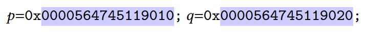
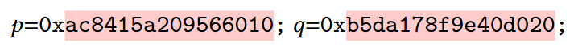

Fully Randomized Pointers (BlueFat)
===================================

BlueFat is a software implementation of the concept of *Fully Randomized
Pointers* (FRPs).

FRPs are an experimental pointer (`p`) encoding that:

1. Achieves full binary **compatibility** with all the standard pointer
   operations, including: dereference (`*p`), arithmetic (`p + k`), comparison
   (`p < q`), etc.
2. **Uses a fully randomized bit representation** meaning that pointers are
   essentially just random numbers.

FRPs are a drop-in replacement of the standard pointer representation
(machine addresses), while maintaining full compatibility with existing binary
code (without recompilation).
Compared to machine addresses, FRPs have **much stronger security
guarantees** against memory errors, including inter-object buffer overflows
and use-after-free.

Motivation
----------

Normally, C/C++ pointers are implemented as ordinary machine addresses.
However, addresses are often predictable, meaning that memory errors (buffer
overflows, use-after-free) can be easily *exploited*.
For example, consider the following pair of memory allocations:
`p = malloc(10)` and `q = malloc(10)`.
Then example memory addresses for `p` and `q` could be:

An attacker can easily access `q` through the pointer `p` by using a buffer
overflow and predicting the relation: `q = p + 16`.

In contrast, example FRP values could be:

Note that, unlike addresses, FRP values are essentially just randomized
numbers, meaning that the relationship between `p` and `q` is now **wholly
unpredictable**.
This also means that the above buffer overflow attack is no longer feasible,
since the attacker would need to predict the very specific relationship
(`q = p + 672727314255736848`) in order to execute a successful attack.
As such, exploiting memory errors *under the FRP encoding is impractical*,
i.e., FRPs implement a strong (probabilistic) guarantee.

Furthermore, since FRPs implement the full pointer semantics while also being
ordinary machine words (like addresses), FRPs retain *full backwards
compatibility with existing binary code without recompilation*.

Implementation
--------------

FRPs are implemented using an extra layer of indirection.
Basically, when a pointer is dereferenced, the FRP value is mapped to the
corresponding address that is used to access the underlying object.
This also means that FRPs has no effect on the layout of objects in memory,
unlike other heap randomizers such as DieHard(er).
The implementation also checks for object bounds errors, and use-after-free
errors are detected as missing map entries.

The proof-of-concept software implementation of FRP (BlueFat) uses *Dynamic
Binary Instrumentation* (DBI) to implement the necessary mapping and
checking.
However, since DBI is slow, BlueFat is not intended for widespread
deployment, and is instead intended to validate the security/compatibility
properties of FRPs.
The aim is to eventually implement FRPs directly in hardware, allowing for
strong security/compatibility guarantees with a minimal performance loss.

The origins of FRPs (and BlueFat) can be traced back to the *RedFat binary
hardening system*:

* [https://github.com/GJDuck/RedFat](https://github.com/GJDuck/RedFat)

Specifically, the goal is stronger memory safety guarantees without
compromising on binary compatibility.
To help achieve this, we also drop RedFat's assumption that the hardening
solution must run on existing (`x86_64`) hardware.
Assuming that the hardware itself can be redesigned, this allows for more
"radical" pointer encodings that strike a good balance between security and
compatibility, such as FRPs.

Building & Running
------------------

To use the current prototype, please perform the following steps:

1. Download and setup your local pin installation, version:

        pin-3.22-98547-g7a303a835-gcc-linux

   Other versions may work but this is *UNTESTED*.
2. Copy everything from this folder to your pin directory (`<PIN_DIR>`)
3. Enter the directory `<PIN_DIR>/libbluefat` and build the preload library using `make`.
4. Build the pintool `bluefat.cpp` available in `<PIN_DIR>/source/tools/ManualExamples/`.

To use the tool,

        LD_PRELOAD=<PIN_DIR>/libbluefat.so <PIN_DIR>/pin -t <PIN_DIR>/source/tools/ManualExamples/obj-intel64/bluefat.so -- <APPLICATION_BINARY_WITH_ARGS>

License
-------

This software has been released under the GNU Public License (GPL) Version 3.
See the `LICENSE` file for more information.

Preprint
--------

* Gregory J. Duck, Sai Dhawal Phaye, Roland H. C. Yap, Trevor E. Carlson,
  [*Fully Randomized Pointers*](https://arxiv.org/abs/2405.12513), 2024

